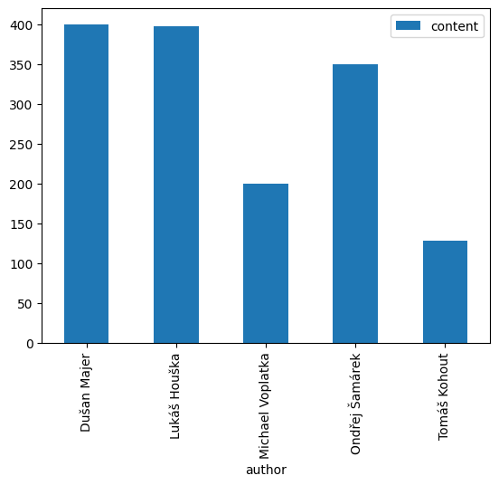
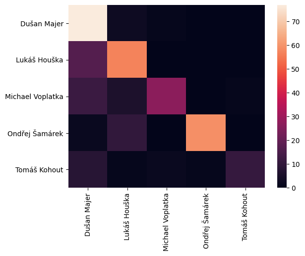

# Task: Recognize author of a blog article
1. download 1000 articles from the blog https://kosmonautix.cz
2. extract following information from every article:
      *  title
      *    author
      *    date of creation
      *    article content as plain text (it must be properly cleaned)    
3. store the data into file(s) for later processing
4. split dataset to training, validation and testing data
5. train DNN to be able to recognize the author of the article
a. input: tokenized and padded text of the article
b. output: author of the article
6. verify accuracy on test data
7. explain results

## Project description
Project structure
1. Figure (directory with figures from learning and analysis)
2. Scraper (directory containing scraper KosmonautixSpider.py)
3. main.py (script to run)
4. dataPreprocessing.py (function definition for data cleaning and vectorizing)
5. model.py (model definition)
### Brief Aproach Description:

*Data collection*
- I obtained 5412 articles from https://kosmonautix.cz (crawler script and data are in Scraper directory)

*Data analysis*
- I noticed that some articles are just short announcements (about tv broadcasting and surveys) that are not relevant for authorship recognition
    * I calculated 25% quantile of article length and remove all articles that have a lower length than the quantile.
- I analyzed articles and found out some issues:
    * Data are skewed, articles are written by 31 authors, but a majority of articles are written by one author (Even dummy classifier predicting always Dusan Majer would have high accuracy.)
    * I reduced the number of Dusan Majer articles to 400
    * I filter out articles of "lazy" authors (authors who have written less than 100 articles)
    * I end up with a dataset containing articles from 5 authors, as you can see classes are still unbalanced and because of that model is likely to fail to classify outnumbered classes(Michael Voplatka, Tomaš Kohout).
    
- During data cleaning, I removed interpunction and stop words
- To conclude I create a dataset containing 1475 articled from 5 authors
    
*Data Vectorizing*
- I decided to use simple text encoding, every word is represented by a unique number. For classification, I used the first 500 words from an article, so every article is represented by a vector containing 500 numbers.
- I thought about using a more complex method such as GloVe, but I was not sure if a general model could handle technical terms in articles. 

*Model*
- In my opinion, what is significant for every author is the choice of words and order of words, because of that I create LSTM
- Model also performs vector normalization and regularization

*Optimal parameters search*
- units in LSTM = 150 (based by grid search)
- epochs = 4 (based on learning curves)

*Model evaluation*
- model perform with accuracy 78,3 %
- model perform poorly on outnumbered classes see confusion matrix

### Possible improvement
- Usage of different vector embedding approaches such us GloVe (represents better relationship between words)
- Obtain more articles for outnumbered classes
- Try to find the optimal length of a vector (number of words from article used for classification)
